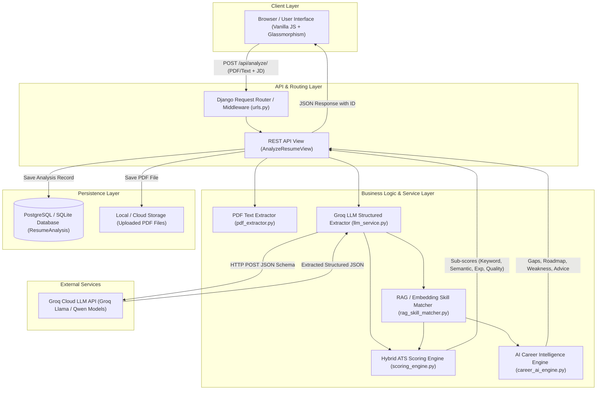
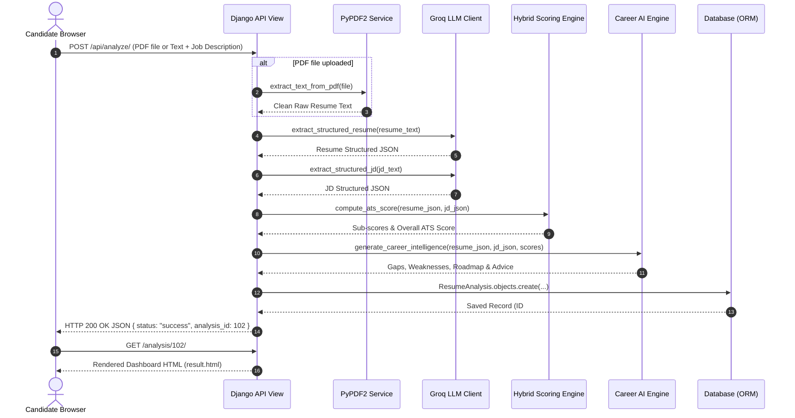

# System Architecture Document

## Product Name: AI Resume Analyzer & ATS Job Matcher (ResumeIQ)
**Document Version:** 1.0  
**Status:** Approved Architectural Blueprint  
**Primary Framework:** Django 4.2 LTS / Groq LLM Acceleration / scikit-learn NLP  

---

## 1. Executive Architecture Summary

The **AI Resume Analyzer & ATS Job Matcher** is a web-based artificial intelligence platform designed to parse candidate resumes, compare them against target job descriptions, calculate a 4-factor ATS match score (Keyword, Semantic, Experience, Quality), and synthesize explainable career intelligence.

The architecture emphasizes **practicality, transparency, and high performance** — avoiding unnecessary microservices or heavy message brokers for the MVP. It uses a monolithic Django application with modular service layers, fast in-memory TF-IDF vectorization, external high-speed LLM inference (Groq API), and persistent ORM storage.

---

## 2. Tech Stack Selection & Justification

```
┌─────────────────────────────────────────────────────────────────────────────┐
│                             FULL TECH STACK                                 │
├───────────────────┬─────────────────────────────────────────────────────────┤
│ Layer             │ Technologies Chosen                                     │
├───────────────────┼─────────────────────────────────────────────────────────┤
│ Frontend UI       │ HTML5, Vanilla JavaScript (ES6+), Modern CSS3 (Glass)   │
│ Backend Web App   │ Python 3.10+, Django 4.2 LTS, Django REST Framework     │
│ AI / LLM Engine   │ Groq API (Llama 3 70B, Qwen 3.6 27B, Compound Mini)     │
│ Semantic NLP      │ scikit-learn (TF-IDF Vectorizer & Cosine Similarity)    │
│ PDF Extraction    │ PyPDF2 (Binary text layer parser)                       │
│ Data Persistence  │ PostgreSQL (Production via Supabase) / SQLite (Local)  │
│ Asset Delivery    │ WhiteNoise (Static file middleware)                     │
│ Server / Gateway  │ Gunicorn / Uvicorn (WSGI/ASGI application server)       │
└───────────────────┴─────────────────────────────────────────────────────────┘
```

### Justification:
* **Django 4.2 LTS:** Provides built-in ORM, secure session management, administrative interface, and rapid REST API integration with Django REST Framework (DRF).
* **Groq LLM Acceleration:** Delivers ultra-low latency LLM inference (< 1.5s per extraction request), critical for maintaining a sub-4-second end-to-end SLA.
* **scikit-learn (TF-IDF + Cosine Similarity):** Enables deterministic, fast vector similarity calculations locally without sending raw embeddings over external network boundaries.
* **Vanilla CSS/JS (No Heavy Framework Overhead):** Ensures lightweight, zero-build-step deployment and instant browser rendering.

---

## 3. High-Level System Architecture & Component Diagram



---

## 4. Subsystem Components & Responsibilities

### 4.1 Ingestion & Parsing Subsystem (`pdf_extractor.py`)
* **Responsibility:** Ingest binary PDF files or raw text input.
* **Mechanism:** Utilizes `PyPDF2.PdfReader` to extract clean text streams, handles empty pages, strips control characters, and performs minimum character length checks ($\ge 100$ chars).

### 4.2 LLM Entity Extraction Subsystem (`llm_service.py`)
* **Responsibility:** Convert unstructured resume text and JD text into strongly typed JSON structures.
* **Mechanism:** Formulates prompt templates enforcing Pydantic-like JSON output. Features multi-model failover rotation:
  $$\text{Model Chain: } \texttt{groq/compound-mini} \longrightarrow \texttt{qwen/qwen3.6-27b} \longrightarrow \texttt{openai/gpt-oss-120b}$$

### 4.3 Hybrid ATS Scoring Subsystem (`scoring_engine.py`)
* **Responsibility:** Calculate the 4-part weighted ATS score.
* **Formulas:**
  1. **Keyword Overlap ($S_{\text{keyword}}$ - 40%):** Exact skill set intersection.
  2. **Semantic Similarity ($S_{\text{semantic}}$ - 30%):** TF-IDF n-gram vectorization and Cosine Similarity:
     $$\text{Cosine Similarity}(\vec{A}, \vec{B}) = \frac{\vec{A} \cdot \vec{B}}{\|\vec{A}\| \|\vec{B}\|}$$
  3. **Experience Score ($S_{\text{experience}}$ - 20%):** Ratio of candidate experience to target requirement.
  4. **Quality Score ($S_{\text{quality}}$ - 10%):** Checks for metrics/numbers, projects, education, contact info.

### 4.4 AI Career Intelligence Subsystem (`career_ai_engine.py`)
* **Responsibility:** Generate explainable feedback components.
* **Outputs:** Critical Skill Gaps, Advanced Skill Gaps, Resume Weaknesses, 5-Step Sequential Roadmap, Personalized Advice.

### 4.5 Persistence & Reporting Subsystem (`models.py`, `views.py`)
* **Responsibility:** Save analysis results to the database (`ResumeAnalysis` ORM model) and render interactive dashboards.

---

## 5. End-to-End Data Flow Sequence



---

## 6. Database Architecture & Storage Strategy

### 6.1 Database Schema (`ResumeAnalysis` Entity)
The database stores both structured scalar metrics and serialized JSON data arrays to maintain full fidelity of historical runs.

```
┌─────────────────────────────────────────────────────────────────────────────┐
│                          ResumeAnalysis ENTITY                              │
├────────────────────────────┬──────────────────┬─────────────────────────────┤
│ Field Name                 │ Type             │ Description                 │
├────────────────────────────┼──────────────────┼─────────────────────────────┤
│ id                         │ BigAutoField     │ Primary Key                 │
│ user                       │ ForeignKey(User) │ FK to Auth User             │
│ resume_file                │ FileField        │ PDF path in media/resumes/  │
│ resume_text                │ TextField        │ Raw resume text             │
│ job_description            │ TextField        │ Target job description      │
│ status                     │ CharField(20)    │ pending/completed/failed    │
│ ats_score                  │ FloatField       │ Final score (0-100)         │
│ keyword_score              │ FloatField       │ Keyword sub-score (0-100)   │
│ semantic_score             │ FloatField       │ Semantic sub-score (0-100)  │
│ experience_score           │ FloatField       │ Experience score (0-100)    │
│ quality_score              │ FloatField       │ Quality score (0-100)       │
│ detected_role              │ CharField(200)   │ Detected job title          │
│ experience_level           │ CharField(100)   │ Seniority level             │
│ critical_skill_gaps_json   │ TextField        │ JSON array                  │
│ advanced_skill_gaps_json   │ TextField        │ JSON array                  │
│ resume_weaknesses_json     │ TextField        │ JSON array                  │
│ career_roadmap_json        │ TextField        │ JSON array                  │
│ personalized_advice        │ TextField        │ Advice text                 │
│ skill_match_breakdown_json │ TextField        │ JSON map                    │
│ created_at                 │ DateTimeField    │ Auto creation timestamp     │
│ updated_at                 │ DateTimeField    │ Auto update timestamp       │
└────────────────────────────┴──────────────────┴─────────────────────────────┘
```

### 6.2 File & Media Storage
* **Local Development:** Uploaded PDF files are stored in `media/resumes/` and served locally.
* **Production Deployment:** Configured to support cloud object storage (e.g. AWS S3 or Supabase Storage) via Django `django-storages`.

---

## 7. API Specifications & Endpoints

### Endpoint 1: Submit Analysis Request
* **URL:** `/api/analyze/`
* **HTTP Method:** `POST`
* **Content-Type:** `multipart/form-data` or `application/json`
* **Request Parameters:**
  * `resume_file` *(optional file)*: `.pdf` binary document.
  * `resume_text` *(optional string)*: Raw text string (required if `resume_file` absent).
  * `job_description` *(required string)*: Plain text job posting ($\ge 100$ chars).

* **Response Payload (HTTP 200 OK):**
```json
{
  "status": "success",
  "analysis_id": 42,
  "ats_score": 78.5,
  "sub_scores": {
    "keyword_score": 80.0,
    "semantic_score": 75.0,
    "experience_score": 85.0,
    "quality_score": 70.0
  },
  "result_url": "/analysis/42/"
}
```

### Endpoint 2: Retrieve Analysis Record
* **URL:** `/api/analysis/<id>/` or `/analysis/<id>/`
* **HTTP Method:** `GET`
* **Response:** HTML View Dashboard or REST JSON Representation of the stored `ResumeAnalysis` model.

---

## 8. Authentication & Authorization Architecture

* **Web Session Authentication:** Standard Django session middleware using HTTP-only secure cookies (`sessionid`).
* **API Token Authorization:** DRF Token authentication header (`Authorization: Token <token>`) for headless or external API access.
* **Object-Level Authorization:** Views enforce ownership verification — candidates can only inspect or delete `ResumeAnalysis` instances where `instance.user == request.user`.

---

## 9. Security Architecture

1. **Secrets Management:** Secrets (`GROQ_API_KEY`, `SECRET_KEY`, `DATABASE_URL`) are stored strictly in environment variables (`.env`) and loaded via `python-dotenv`.
2. **CSRF Protection:** State-modifying requests (`POST`) enforce Django's built-in CSRF token checks (``).
3. **File Upload Security:**
   * Strict validation of `.pdf` file extension and file MIME headers.
   * File size capped at 5MB.
   * Executable flags disabled in media storage directory.
4. **Injection Defenses:**
   * **SQL Injection:** Mitigated by Django ORM parameterized queries.
   * **XSS (Cross-Site Scripting):** Django template rendering automatically escapes string variables.

---

## 10. Deployment & Infrastructure Strategy

```
                          ┌──────────────────────────┐
                          │   Client Browser         │
                          └────────────┬─────────────┘
                                       │ HTTPS (443)
                                       ▼
                          ┌──────────────────────────┐
                          │  Reverse Proxy / Nginx   │
                          │  or Cloud Gateway        │
                          └────────────┬─────────────┘
                                       │
                    ┌──────────────────┴──────────────────┐
                    │                                     │
                    ▼                                     ▼
     ┌─────────────────────────────┐       ┌─────────────────────────────┐
     │ Gunicorn WSGI Server        │       │ WhiteNoise Static File      │
     │ (Django App / Python 3.10)  │       │ Middleware (CSS / JS)       │
     └──────────────┬──────────────┘       └─────────────────────────────┘
                    │
            ┌───────┴───────┐
            │               │
            ▼               ▼
     ┌─────────────┐ ┌─────────────┐
     │ Database    │ │ Groq LLM    │
     │ (Postgres)  │ │ Cloud API   │
     └─────────────┘ └─────────────┘
```

* **Application Hosting:** Compatible with modern Cloud PaaS platforms (Render, Fly.io, AWS App Runner).
* **Static Assets:** Handled efficiently in production using `WhiteNoise` middleware directly inside Django.
* **Database Hosting:** Managed PostgreSQL database (e.g. Supabase or Neon) configured via `dj-database-url`.

---

## 11. Monitoring, Logging & Observability

* **Structured Python Logging:** Standardized logging output via Python's `logging` module configured in `config/settings.py`.
* **API Audit Logging:** Log entries record API request durations, model failovers, and HTTP response statuses.
* **Error Alerting:** Unhandled backend exceptions trigger HTTP 500 responses and log stack traces for rapid diagnostic isolation.

---

## 12. Scalability & Performance Roadmap

* **Phase 1 (Current Monolith):** Synchronous request handling supported by Groq's high-speed inference engine, executing analyses under 4.0 seconds.
* **Phase 2 (Async Queue via Celery & Redis):** Offload PDF parsing and LLM API calls to background worker tasks (`celery`) with WebSocket status updates for long-running inputs.
* **Phase 3 (Caching Layer via Redis):** Cache vector embeddings and repetitive skill extractions in Redis to reduce redundant LLM calls.
