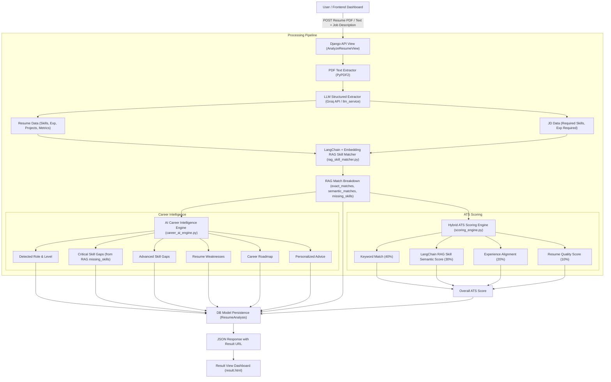

# System Architecture & Technical Documentation

## AI Resume Analyzer & ATS Job Matcher

---

## 1. Overview

**AI Resume Analyzer & ATS Job Matcher** is a hybrid artificial intelligence application built with **Django**, **Groq LLM Acceleration**, and **scikit-learn NLP**. It automatically parses candidate resumes (PDF or raw text), extracts structured professional data, computes a multi-metric ATS (Applicant Tracking System) match score against any Job Description (JD), and generates detailed, explainable career intelligence (Critical Gaps, Advanced Gaps, Resume Weaknesses, Sequential Career Roadmap, and Personalized Advice).

---

## 2. System Architecture & Data Flow



---

## 3. Component Execution Lifecycle

1. **Client Request Submission**: The candidate submits their resume (via PDF file upload or direct text paste) and a target Job Description to `/api/analyze/`.
2. **Text Ingestion & Extraction**: If a PDF is uploaded, `extract_text_from_pdf()` processes the binary stream and extracts clean raw text.
3. **Structured Data Parsing**: `llm_service.py` calls the Groq API (using active ultra-fast models like `groq/compound-mini` or `qwen/qwen3.6-27b`) to parse technical skills, years of experience, projects, education, and quantified achievements.
4. **Hybrid ATS Scoring**:
   - `scoring_engine.py` evaluates exact skill overlaps (Keyword Score).
   - Generates TF-IDF n-gram vectors and computes Cosine Similarity (Semantic Score).
   - Compares candidate experience against JD requirements (Experience Score).
   - Audits resume formatting, metrics, projects, and contact info (Quality Score).
5. **AI Career Intelligence Generation**: `career_ai_engine.py` analyzes the candidate's complete profile against the target role to generate critical skill gaps, advanced skill gaps, structural resume weaknesses, a 5-step career roadmap, and tailored strategic advice.
6. **Persistence & Presentation**: The result is saved to the PostgreSQL/SQLite database (`ResumeAnalysis` model) and displayed on an interactive dashboard with score gauges and progress bars.

---

## 4. Technologies Used & Full Explanation

| Layer / Component | Technology | Purpose & How It Works |
| :--- | :--- | :--- |
| **Web Framework** | **Django 4.2** | Core backend framework handling routing, request parsing, session management, template rendering, and database abstraction (ORM). |
| **API Layer** | **Django REST Framework (DRF)** | Provides structured REST API endpoints (`/api/analyze/`, `/api/analysis/<id>/`) supporting `MultiPartParser` (file uploads) and JSON payloads. |
| **AI / LLM Engine** | **Groq API & Llama/Qwen Models** | Ultra-high-speed LLM inference engine. Powers structured JSON extraction, skill gap identification, career roadmap synthesis, and personal advice. Implements automatic multi-model rotation (`groq/compound-mini`, `qwen/qwen3.6-27b`, `openai/gpt-oss-120b`). |
| **Semantic NLP Matching** | **scikit-learn (TF-IDF & Cosine Similarity)** | Vectorizes the textual content of both the resume and the job description using Term Frequency-Inverse Document Frequency (TF-IDF) and computes spatial Cosine Similarity between the vectors without relying exclusively on LLMs. |
| **PDF Extraction** | **PyPDF2** | Parses PDF document pages, extracts text layers, cleans whitespace, and returns plaintext for ingestion. |
| **Database** | **PostgreSQL (Supabase) / SQLite** | Stores historical resume analyses, calculated scores, breakdown metrics, and extracted career intelligence using Django's ORM and `dj-database-url`. |
| **Environment Config** | **python-dotenv** | Securely manages secrets and environment variables (`GROQ_API_KEY`, `DATABASE_URL`, `SECRET_KEY`) isolated from version control. |
| **Static Assets** | **WhiteNoise** | Efficiently serves static files (CSS, JavaScript, images) directly from the Python/Django web application. |
| **Frontend UI** | **Vanilla JS, HTML5, Modern CSS** | Interactive UI featuring dynamic score progress circles, expandable breakdown cards, and responsive glassmorphism aesthetic styling. |

---

## 5. ATS Scoring Algorithm Formula

The ATS matching engine uses a weighted hybrid formula:

$$\text{ATS Score} = (S_{\text{keyword}} \times 0.40) + (S_{\text{semantic}} \times 0.30) + (S_{\text{experience}} \times 0.20) + (S_{\text{quality}} \times 0.10)$$

### Sub-Score Computation Breakdown

1. **Keyword Match ($S_{\text{keyword}}$ - 40%)**:
   Calculated by checking extracted technical skills from the resume against the required skills identified in the Job Description:
   $$S_{\text{keyword}} = \frac{|\text{Resume Skills} \cap \text{Required JD Skills}|}{|\text{Required JD Skills}|} \times 100$$

2. **Semantic Similarity ($S_{\text{semantic}}$ - 30%)**:
   Evaluates how closely the overall context and terminology of the resume matches the job description using TF-IDF n-gram vectorization and Cosine Similarity:
   $$\text{Cosine Similarity}(\vec{A}, \vec{B}) = \frac{\vec{A} \cdot \vec{B}}{\|\vec{A}\| \|\vec{B}\|}$$

3. **Experience Match ($S_{\text{experience}}$ - 20%)**:
   Compares the candidate's years of experience against the requested experience level in the job description:
   - Full points ($100\%$) if candidate experience meets or exceeds requirement.
   - Pro-rated score if partial experience is present.

4. **Resume Quality ($S_{\text{quality}}$ - 10%)**:
   Audits the resume structure:
   - Presence of quantified metrics/numbers in experience bullet points (+30%)
   - Listed projects (+30%)
   - Stated education (+20%)
   - Contact info (+20%)

---

## 6. Directory & Code Base Structure

```
ai_resume_analyzer/
├── ARCHITECTURE.md                  # Project Architecture & Tech Stack Documentation
├── README.md                        # Quickstart guide & installation instructions
├── manage.py                        # Django command-line utility
├── requirements.txt                 # Project dependencies
├── .env                             # Environment variables & API keys (git-ignored)
│
├── config/                          # Core Django Project Configuration
│   ├── settings.py                  # App settings, DB config, Groq API key, middleware
│   ├── urls.py                      # Global URL router
│   ├── wsgi.py                      # WSGI server entry point
│   └── asgi.py                      # ASGI server entry point
│
├── resume_analyzer/                 # Primary Application Module
│   ├── models.py                    # ResumeAnalysis DB schema
│   ├── views.py                     # API views (AnalyzeResumeView, result_view, history_view)
│   ├── urls.py                      # Application URL routes
│   ├── serializers.py               # DRF Serializers for API requests/responses
│   ├── forms.py                     # User authentication forms
│   │
│   ├── services/                    # Business Logic & Core Engines
│   │   ├── llm_service.py           # Groq API client, model fallback, resume/JD extraction
│   │   ├── career_ai_engine.py      # Skill gap analysis, career roadmap & advice engine
│   │   ├── scoring_engine.py        # ATS hybrid scoring formula (TF-IDF + Cosine Similarity)
│   │   ├── pdf_extractor.py         # PyPDF2 PDF text extraction service
│   │   └── skill_extractor.py       # Rule-based fallback skill extraction
│   │
│   └── templates/                   # HTML Templates
│       ├── base.html                # Base layout with navbar & styling
│       └── resume_analyzer/
│           ├── index.html           # Main analysis upload form & JD input
│           ├── result.html          # ATS score dashboard, skill gaps & career roadmap
│           └── history.html         # Past analysis history page
│
└── static/                          # Static files (CSS, JavaScript, branding assets)
```
