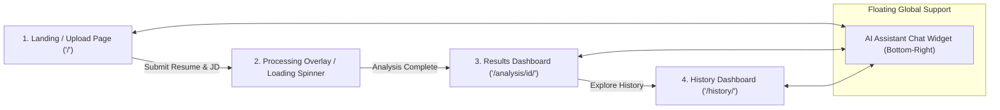

# UI/UX Design & Interface Specification

## Product Name: AI Resume Analyzer & ATS Job Matcher (ResumeIQ)
**Document Version:** 1.0  
**Status:** Approved Design Specification  
**Design Aesthetic:** Modern Minimalist Editorial & Warm Glassmorphism  

---

## 1. Design System & Style Guide

### 1.1 Palette & Color System
The application uses an editorial, warm palette combining rich terracotta (`--clay`), deep obsidian ink (`--ink`), and warm muted parchment backgrounds (`--bg-soft`).

```css
:root {
  /* Brand Primary Accents */
  --clay: #D97757;             /* Terracotta Brand Primary */
  --clay-dark: #BF5B3E;        /* Hover & Primary Gradient Dark */
  --clay-deep: #96442E;        /* Active Accent & Deep Borders */

  /* Neutral Ink Hierarchy */
  --ink: #1F1B16;              /* Primary High-Contrast Headlines & Text */
  --ink-dim: #6B6459;          /* Secondary Body Text & Sub-captions */
  --ink-faint: #A8A096;        /* Placeholders & Disabled Icons */

  /* Surface & Background Neutrals */
  --bg-soft: #F5F4ED;          /* Page Background / Input Containers */
  --surface: #FFFFFF;          /* Card & Container Fill */
  --white: #FFFFFF;
  --border: #E1DED2;           /* Subtle Dividers & Card Outlines */

  /* Contextual Status Colors */
  --success: #008A05;          /* High Match (>=75%) & Matched Badges */
  --success-bg: rgba(0,138,5,0.08);
  --success-border: rgba(0,138,5,0.25);
  
  --warning: #D97706;          /* Moderate Match (50-74%) */
  --warning-bg: rgba(217,119,6,0.08);
  
  --error: #C13515;            /* Low Match (<50%) & Validation Alerts */
  --error-bg: #FEF1EF;
  --error-border: #FBD4CD;

  /* Typography Tokens */
  --font: 'Inter', -apple-system, BlinkMacSystemFont, sans-serif;
  --font-serif: 'Source Serif 4', Georgia, serif;

  /* Elevation & Geometry */
  --radius-sm: 8px;
  --radius-md: 12px;
  --radius-pill: 999px;
  --shadow-card: 0 2px 8px rgba(0,0,0,0.06);
  --shadow-hover: 0 6px 20px rgba(0,0,0,0.12);
}
```

### 1.2 Typography Hierarchy

| Style Token | Font Family | Size | Weight | Line Height | Usage |
| :--- | :--- | :--- | :--- | :--- | :--- |
| **Display Title (H1)** | `Source Serif 4` | `2.4rem` (38px) | `700` | `1.15` | Hero banner titles |
| **Section Header (H2)**| `Source Serif 4` | `1.6rem` (26px) | `700` | `1.25` | Card headings & module titles |
| **Subhead (H3)** | `Inter` | `1.1rem` (18px) | `700` | `1.35` | Sub-card metrics & roadmap steps |
| **Body Standard** | `Inter` | `0.95rem` (15px) | `400` | `1.55` | Paragraphs, advice, textareas |
| **Caption & Badges** | `Inter` | `0.85rem` (13.5px)| `600` | `1.40` | Metadata, date pills, nav items |
| **Metric Gauge Label** | `Inter` | `2.8rem` (45px) | `800` | `1.00` | Big percentage score display |

---

## 2. User Journey & Navigation Architecture



### Navigation Anatomy
* **Header Bar (`<nav>`):** Sticky at top (`position: sticky; top: 0; z-index: 100`).
  * Left: Brand logo with gradient icon mark (`ResumeIQ`).
  * Center: Primary navigation links (`Analyze`, `History`) with active underline indicator.
  * Right: User profile indicator (`Welcome, Candidate`) & Logout CTA pill button.

---

## 3. Screen Specifications & Layout Wireframes

### Screen 1: Input & Analysis Submission (`index.html`)

```
┌─────────────────────────────────────────────────────────────────────────────┐
│  ResumeIQ                                       Analyze   History   Logout  │
├─────────────────────────────────────────────────────────────────────────────┤
│                                                                             │
│   Optimize Your Application for ATS & Recruiters                            │
│   Upload your resume and target job description to get an instant match.    │
│                                                                             │
│ ┌──────────────────────────────────────┐ ┌────────────────────────────────┐ │
│ │ Candidate Resume                     │ │ Target Job Description / Role  │ │
│ │ ┌──────────────────────────────────┐ │ │ ┌────────────────────────────┐ │ │
│ │ │ [ Upload PDF ]  [ Paste Text ]   │ │ │ │ Paste job description OR   │ │ │
│ │ └──────────────────────────────────┘ │ │ │ enter target role name...   │ │ │
│ │ Drag & drop resume.pdf (Max 5MB)   │ │ │ │ (e.g. Full Stack Engineer) │ │ │
│ └──────────────────────────────────────┘ └────────────────────────────────┘ │
│                                                                             │
│                      [  ⚡ Calculate ATS Match Score  ]                      │
│                                                                             │
└─────────────────────────────────────────────────────────────────────────────┘
```

#### Key Components:
1. **Input Mode Switcher:** Tabbed selector toggling between `.pdf` File Upload and Raw Text Area.
2. **File Dropzone:** Drag-and-drop file target displaying uploaded filename, size, and file removal button.
3. **Job Description / Role Textarea:** Flexible text field accepting either a complete job description or target role name with automated skill inference.
4. **Primary Action Button:** Full-width gradient button with micro-hover uplift effect (`transform: translateY(-1px)`).

---

### Screen 2: Results Dashboard (`result.html`)

```
┌─────────────────────────────────────────────────────────────────────────────┐
│ ┌─────────────────────────────────────────────────────────────────────────┐ │
│ │  OVERALL ATS MATCH SCORE                                                │ │
│ │    ( 78% )  High ATS Compatibility  •  Role: Senior Python Developer   │ │
│ └─────────────────────────────────────────────────────────────────────────┘ │
│                                                                             │
│ ┌───────────────┐ ┌───────────────┐ ┌───────────────┐ ┌───────────────┐ │
│ │ Keyword Score │ │ Semantic Score│ │ Experience    │ │ Resume Quality│ │
│ │   80% (35%)   │ │   75% (35%)   │ │   85% (15%)   │ │   70% (15%)   │ │
│ └───────────────┘ └───────────────┘ └───────────────┘ └───────────────┘ │
│                                                                             │
│ ┌───────────────────────────────────┐ ┌───────────────────────────────────┐ │
│ │ Critical Skill Gaps               │ │ Advanced Skill Gaps               │ │
│ │ 🔴 Docker   🔴 Kubernetes         │ │ 🟡 GraphQL   🟡 AWS Lambda        │ │
│ └───────────────────────────────────┘ └───────────────────────────────────┘ │
│                                                                             │
│ ┌─────────────────────────────────────────────────────────────────────────┐ │
│ │ 🚀 5-Step Actionable Career Roadmap                                     │ │
│ │ [Step 1] Master Docker Containerization                                │ │
│ │ [Step 2] Build Microservices Project with Kubernetes                   │ │
│ └─────────────────────────────────────────────────────────────────────────┘ │
└─────────────────────────────────────────────────────────────────────────────┘
```

#### Key Components:
1. **Score Header Gauge:** Prominent circular score indicator with color-coded classification badge.
2. **Sub-Metric Score Cards:** 4 side-by-side progress cards showing calculated percentages vs formula weights.
3. **Skill Pill Badges:** Green pill badges for matched competencies; Red/Yellow pill badges for gaps.
4. **Career Intelligence Accordions:** Expandable cards for weaknesses, roadmap stages, and personal advice.

---

### Screen 3: Floating AI Career Assistant Panel (`chat-widget`)

* **Trigger Button:** Fixed circular button at bottom-right (`bottom: 28px; right: 28px`) with pulsing status indicator.
* **Panel Container:** Sliding glassmorphism modal (`380px` width $\times$ `560px` max-height).
* **Header:** Gradient background with assistant avatar (`✨`), title, and close button (`✕`).
* **Message Feed:** Auto-scrolling list of bot and user chat bubbles with animated typing indicators.
* **Input Bar:** Rounded pill text field with send arrow icon button (`➜`).

---

## 4. Interaction States & System Feedback

```
┌─────────────────────────────────────────────────────────────────────────────┐
│                            INTERACTION STATES                               │
├──────────────────┬──────────────────────────────────────────────────────────┤
│ State Type       │ UI Pattern & Visual Feedback                             │
├──────────────────┼──────────────────────────────────────────────────────────┤
│ Default / Idle   │ Muted borders, subtle shadow, active call-to-action      │
│ Hover            │ Card shadow elevation (`--shadow-hover`), 1px uplift     │
│ Focus            │ Crisp `--ink` border outline with 1px ring focus ring     │
│ Loading          │ Skeleton card pulse & linear indeterminate progress bar  │
│ Scanned PDF Alert│ Warning callout banner advising user to paste raw text   │
│ Error Validation │ Red border highlight (`--error`) with inline error message│
│ Empty History    │ Illustrative empty banner with "Analyze First Resume" CTA│
└──────────────────┴──────────────────────────────────────────────────────────┘
```

---

## 5. Responsive Behavior & Breakpoints

### Mobile (< 480px)
* Header navigation collapses menu actions.
* Input forms stack into a single column.
* 4-Factor metric cards switch from 4-across to a vertical stacked stack.
* AI Chat panel spans full screen width (`width: calc(100vw - 32px)`).

### Tablet (481px – 991px)
* Input forms render in single column with wider paddings.
* Metric sub-scores layout in a 2x2 grid.

### Desktop (≥ 992px)
* Container capped at `1100px` max-width.
* Metric cards display in a single 4-column horizontal row.

---

## 6. Accessibility & Usability (WCAG 2.1 AA Compliance)

1. **Color Contrast:** All body text maintains a minimum contrast ratio of **4.8:1** against backgrounds.
2. **Keyboard Navigation:** All interactive elements (`<button>`, `<a href>`, `<input>`) support logical Tab ordering and explicit `:focus-visible` styling.
3. **Screen Reader Support:** Form controls feature semantic `<label>` elements; metric gauges include `aria-valuenow`, `aria-valuemin`, and `aria-valuemax` attributes.
4. **Target Size:** Touch targets for buttons and icons adhere to a minimum size of **$44 \times 44\text{px}$**.
