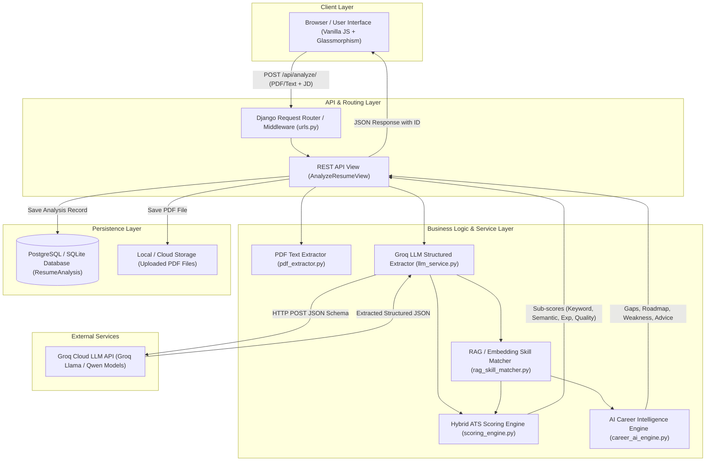
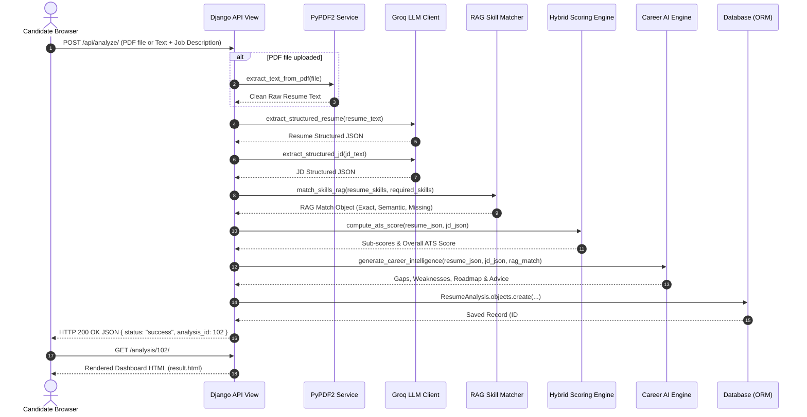

# System Architecture Document

## Product Name: AI Resume Analyzer & ATS Job Matcher (ResumeIQ)
**Document Version:** 1.0  
**Status:** Approved Architectural Blueprint  
**Primary Framework:** Django 4.2 LTS / Groq LLM Acceleration / Sentence Transformers RAG / scikit-learn NLP  

---

## 1. Executive Architecture Summary

The **AI Resume Analyzer & ATS Job Matcher** is a web-based artificial intelligence platform designed to parse candidate resumes, compare them against target job descriptions, calculate a 4-factor ATS match score (Keyword, Semantic/RAG, Experience, Quality), and synthesize explainable career intelligence.

The architecture emphasizes **practicality, transparency, and high performance** — using a monolithic Django application with modular service layers, fast in-memory Sentence Transformer vector embeddings, vector cosine similarity matching, external high-speed LLM inference (Groq API), and persistent ORM storage.

---

## 2. Tech Stack Selection & Justification

```
┌─────────────────────────────────────────────────────────────────────────────┐
│                             FULL TECH STACK                                 │
├───────────────────┬─────────────────────────────────────────────────────────┤
│ Layer             │ Technologies Chosen                                     │
├───────────────────┼─────────────────────────────────────────────────────────┤
│ Frontend UI       │ HTML5, Vanilla JavaScript (ES6+), Modern CSS3 (Glass)   │
│ Backend Web App   │ Python 3.10+, Django 4.2 LTS, Django REST Framework     │
│ AI / LLM Engine   │ Groq API (Llama 3.3 70B, Qwen 3.6 27B, Compound Mini)   │
│ RAG & Vector NLP  │ SentenceTransformers (all-MiniLM-L6-v2), Cosine Sim   │
│ Legacy Semantic   │ scikit-learn (TF-IDF Vectorizer & Cosine Similarity)    │
│ Framework/Orch    │ LangChain & ChromaDB (Dependencies ready for scale)     │
│ PDF Extraction    │ PyPDF2 (Binary text layer parser)                       │
│ Data Persistence  │ PostgreSQL (Production via Supabase) / SQLite (Local)  │
│ Asset Delivery    │ WhiteNoise (Static file middleware)                     │
│ Server / Gateway  │ Gunicorn / Uvicorn (WSGI/ASGI application server)       │
└───────────────────┴─────────────────────────────────────────────────────────┘
```

---

## 3. High-Level System Architecture & Component Diagram



---

## 4. Subsystem Components & Responsibilities

### 4.1 Ingestion & Parsing Subsystem ([`pdf_extractor.py`](file:///c:/Users/parshwanath/OneDrive/Documents/GITHUB-PROJECTS/ai_resume_analyzer/resume_analyzer/services/pdf_extractor.py))
* **Responsibility:** Ingest binary PDF files or raw text input.
* **Mechanism:** Utilizes `PyPDF2.PdfReader` to extract clean text streams, handles empty pages, strips control characters, and performs minimum character length checks ($\ge 100$ chars).

### 4.2 LLM Entity Extraction Subsystem ([`llm_service.py`](file:///c:/Users/parshwanath/OneDrive/Documents/GITHUB-PROJECTS/ai_resume_analyzer/resume_analyzer/services/llm_service.py))
* **Responsibility:** Convert unstructured resume text and JD text into strongly typed JSON structures.
* **Mechanism:** Formulates prompt templates enforcing JSON output. Features multi-model failover rotation across Groq models.

### 4.3 RAG & Embedding Skill Matcher Subsystem ([`rag_skill_matcher.py`](file:///c:/Users/parshwanath/OneDrive/Documents/GITHUB-PROJECTS/ai_resume_analyzer/resume_analyzer/services/rag_skill_matcher.py))
* **Responsibility:** Vector embedding generation and cosine similarity matching.
* **Mechanism:** Generates dense 384-dimensional vectors via `SentenceTransformer('all-MiniLM-L6-v2')`, computes cosine similarity between candidate skills and unmatched job skills, and filters by similarity threshold ($\ge 0.75$).

### 4.4 Hybrid ATS Scoring Subsystem ([`scoring_engine.py`](file:///c:/Users/parshwanath/OneDrive/Documents/GITHUB-PROJECTS/ai_resume_analyzer/resume_analyzer/services/scoring_engine.py))
* **Responsibility:** Calculate the 4-part weighted ATS score.
* **Formulas:**
  1. **Keyword Overlap ($S_{\text{keyword}}$ - 40%):** Exact skill set intersection.
  2. **Semantic Similarity / RAG ($S_{\text{semantic}}$ - 30%):** Vector embedding similarity match score combined with TF-IDF vector similarity.
  3. **Experience Score ($S_{\text{experience}}$ - 20%):** Ratio of candidate experience to target requirement.
  4. **Quality Score ($S_{\text{quality}}$ - 10%):** Checks for metrics/numbers, projects, education, contact info.

### 4.5 AI Career Intelligence Subsystem ([`career_ai_engine.py`](file:///c:/Users/parshwanath/OneDrive/Documents/GITHUB-PROJECTS/ai_resume_analyzer/resume_analyzer/services/career_ai_engine.py))
* **Responsibility:** Generate explainable feedback components with RAG context injection.

---

## 5. End-to-End Data Flow Sequence


